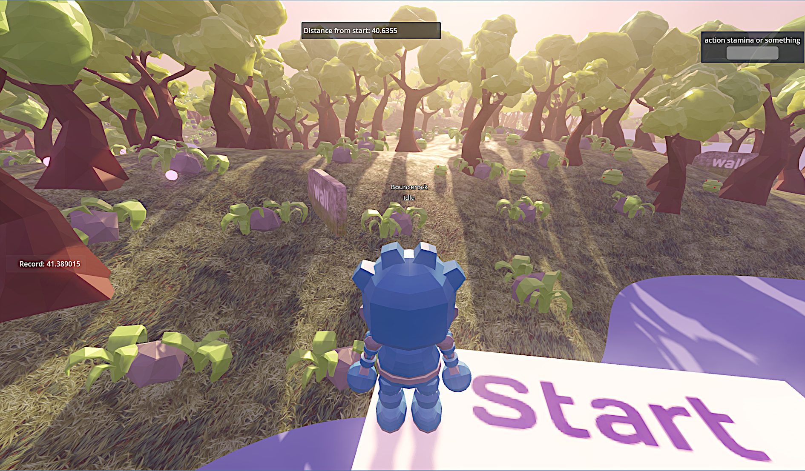
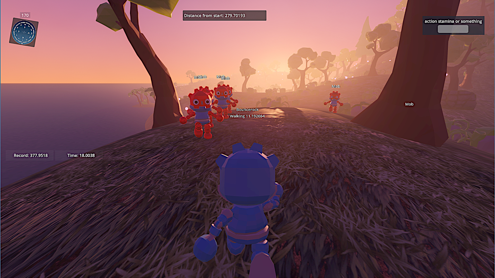
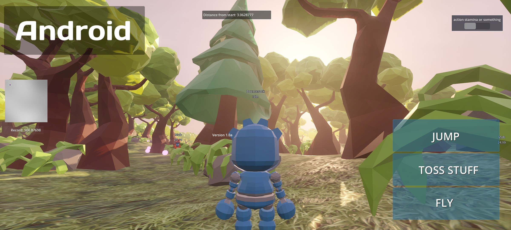
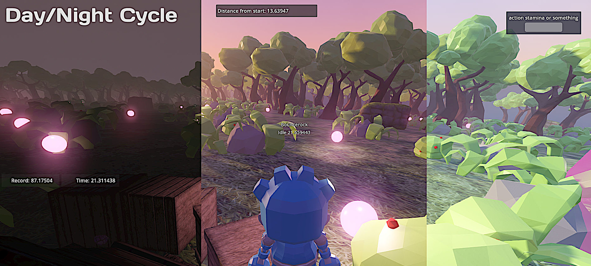

# Infinite Runner - 3D Procedural World Generation Demo Project for Godot C#

Full Godot C# base starter project for procedural infinite terrain generation, including customizable items distribution, physics, water, changing weather, a dynamic day/night cycle, simulating day light and sky color. 
This is also a fully functional TPS project. Read Key Features below for full specs.
For Godot 4+. Works on PC and Android. Other platforms still untested, but probably work as well.

Playable executables can be found here, available on Windows, Android and Linux: https://bouncerocksoftware.itch.io/infinite-runner

## Demo Project
The demo lets you play a Godot robot in third person view. The maps is fully randomized and infinitely explorable. Mindless mobs spawn randomly around the player and move toward you. Walk, run, fly or glide as far as possible, if you let the mobs get too close, the distance counter resets.
How to Play:
- You start in a safe zone, once you get out, mobs start spawning.
- Move using WASD. On mobile, control buttons are available.
- Run using Shift. Consumes stamina.
- Throw crates with Left Click. Crates don't do anything special, it's just a demonstration of physics capabilities. Consumes stamina.
- Jump with Space
- Fly with F. You must be in the air. Consumes stamina.
   Glide while in the air by pressing SHIFT.

Replenish your stamina by collecting pink orbs.

Mobs are constantly spawned around the player.
Doing any sort of action will consume stamina, shown in the upper right bar. Once you're out of stamina, you're only left with your two feet! 
If any mob gets too close, the distance counter resets, the safe zone resets around you, and you need to start over.

## Key Features
- Terrain generation, by default using Godot's Simplex Perlin Noise, but fully extensible and allowing any type of blend or crazy stuff.
- Terrain LOD. Adjustable draw distance.
- Day/night dynamic cycle. 
- The mesh is generated around the player and cleaned depending on distance.
- Objects can be spawned throughout the map, customizable and randomizable.
- Physics enabled playable character and items.
- Water shader, adapting to sky color and depth, supports buoyancy.
- Works on mobile, with adapted touch interface and UI.
- No external dependency, completely self-contained.
- A full Third Person project ready for use. Tweak it to your imagination!
- (New) Clearer and cleaner code. 
  
## Incomplete features
- There is the base code logic to create and save chunk files (FileWriter.cs), making it potentially possible to save chunks data on disk or transfer them to a remote server. This would allow persitent terrain deformation. But not implemented yet.
- Water is now implemented, but your character will not swim just yet, simply continue moving underwater.

## Discord
https://github.com/SirNeirda/godot_procedural_infinite_world/blob/main/images/v99_7.jpg

So if you would like to help or receive help, ask a question or simply chill, welcome to join our [Discord](https://discord.gg/JhnQwUpFBm)! 
