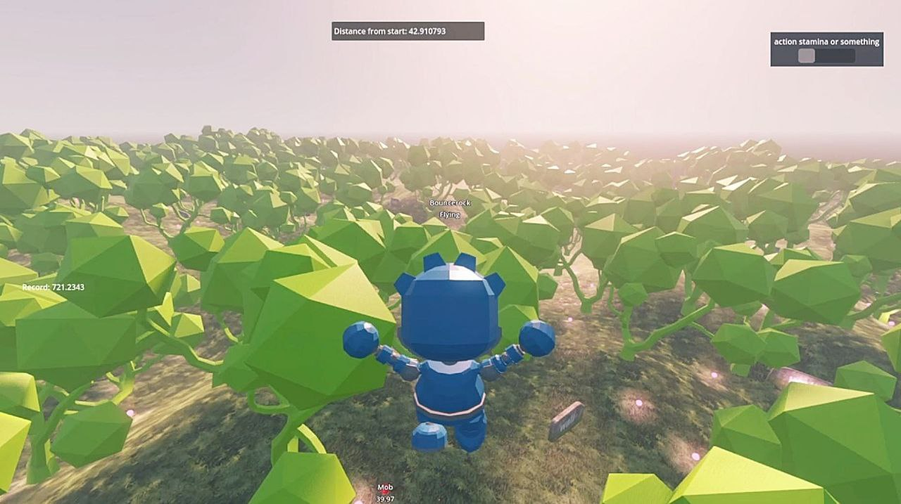

# Godot Procedural World Generation Demo Project

Full Godot C# project for procedural infinite landmass generation, with random items or obstacles spreading throughout the map, with physics enabled. The base mesh generation logic is based on Sebastian Lague's Procedural Landmass Generation, optimized and customized to work in Godot 4.4 and lower.
This project also includes a simple playable demo with a character, showcasing the features. Also includes some helper functions not present in Godot's default engine, such as in-world gizmos and text for easy debugging.

## H2 Demo Project
In the demo, you can play a simple character in third person view. Obstacles are generated and randomized throughout the infinite map. Mindless mobs spawn randomly around the player and move toward him. Try to run away as far away as possible from the starting point, but if you let the mobs get too close, the distance counter resets.
This is a simple starter demo to showcase the project, but can be extended to support any actual gameplay.
How to Play
- You start on an elevated platform.
- Move using WASD
- Run using Shift. Consumes stamina.
- Throw crates with Left Click. Crates don't do anything special. Consumes stamina.
- Jump with Space
- Fly with F. You must be in the air. Consumes stamina.

Replenish your stamina by collecting pink orbs.

Mobs are constantly spawned around the player.
Mobs are cleaned-up when they get too far.
Doing any sort of action will consume stamina, shown in the upper right bar. Once you're out of stamina, you can only walk. 

## H2 Key Features
- Terrain generation, by default using Godot's Simplex Perlin Noise, but fully extensible and allowing any type of blend or crazy stuff.
- Terrain LOD. Adjustable draw distance.
- The mesh is generated around the player and cleaned depending on distance.
- Objects can be spawned throughout the map, customizable and randomizable.
- Physics enabled playable character and items.
- Works surprisingly well on Android
  
## H2 Incomplete features
- There are a selection of shaders to go along the terrain, which are largely incomplete/not working. With the mesh coordinates, it is possible to blend textures according to elevation/orientation, or any other variable supported in Godot.
- Water spawns at elevation 0, but it's a simple mesh with no logic. Although terrain objects will not spawn under elevation zero, the character and mobs will not drown or swim.
- For now there isn't any kind of variable exposed to customize generation, all must be done through code.
- The project is somewhat over-engineered with some overkill functions and classes.
- Works on Android, but there is no logic for touch movement

If you like this project, need help or have cool ideas, join our [Discord](https://discord.gg/JhnQwUpFBm)! 
